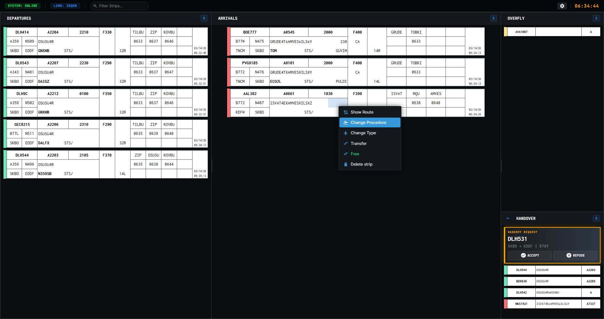

# 🛫 StripCol — VATSIM Colombia Strip Hub


**StripCol** is a high-performance, electronic flight strip management ecosystem custom-built for **VATSIM Colombia (VATCOL)**. It bridges the gap between traditional EuroScope operations and modern web-based interfaces, providing Air Traffic Controllers with a sleek, responsive, and highly functional workspace.



## 🏛️ Architecture

StripCol is designed as a modular **three-tier ecosystem** (located in the `src/` directory):

1.  **.🔌 EuroScope Plugin (C++)**:
    *   Direct integration with the EuroScope SDK.
    *   Exposes real-time flight data via a localized TCP server.
    *   Handles low-level ATC commands and telemetry.
2.  **🌌 Gateway Hub (Node.js)**:
    *   A central orchestration server (Express & WebSocket).
    *   Supports session-based pairing via unique **Link Codes**.
    *   Features a live web console for real-time server monitoring and logs.
3.  **🖥️ Desktop Client (Electron)**:
    *   A professional, high-fidelity UI built for multi-monitor ATC setups.
    *   Features dynamic panels, custom tooltips, and terminal-style configuration.

---

## ✨ Key Features

*   **⚡ Real-Time Synchronization**: Instantaneous updates of aircraft state, altitude, and coordination status.
*   **📂 Precision Management**:
    *   Interactive flight plan modifications (Altitude, Heading, Speed).
    *   Direct-to point routing and STAR/SID assignments.
    *   Seamless automated handoffs and frequency transfers.
*   **🎨 Pro-Grade UI**:
    *   Custom-floating tooltips for rapid data inspection.
    *   Dark-mode optimized for reduced eye strain during long sessions.
    *   Modular panel layout to fit any sector configuration.
*   **📋 Advanced Diagnostics**: Built-in live log viewer at `/api/logs.html` for real-time debugging.

---

## 🚀 Quick Start

### 1. Requirements
*   **Node.js** (Latest LTS)
*   **EuroScope** v3.2 or later
*   **Visual Studio** (if building the plugin from source)

### 2. Installation
```bash
# Clone the repository
git clone https://github.com/Simplezes/StripCol.git

# Install dependencies
npm install
```

### 3. Execution
1.  **Launch EuroScope** and load the `StripCol.dll`.
2.  **Start the Gateway & Client**:
    ```bash
    npm start
    ```
3.  Enter your **Link Code** in the client settings to pair and start controlling.

---

## 🛠️ Technology Stack

*   **Back-End**: Node.js, Express, `ws` (WebSockets)
*   **Front-End**: Vanilla JavaScript, CSS3 (Glassmorphism), Bootstrap 5
*   **Platform**: Electron
*   **Plugin**: C++ (EuroScope SDK)

---

## 📄 License

Distributed under the MIT License.

---

### 🌟 Acknowledgements
*   **Author**: Simplezes
*   **Organization**: [VATSIM Colombia](https://vatcol.org)
*   **Copyright**: © 2026 StripCol Project

---
